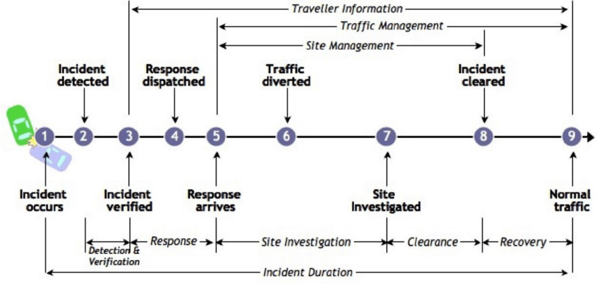

**Title:** *The Great Downtime Debacle: A Postmortem*

**Introduction:**

In the fast-paced world of technology, incidents happen. In this postmortem, we explore an unexpected service outage that occurred on October 15, 2023, and how we responded to it.

**Section 1: Issue Summary:**

- **Duration:**
  - Start Time: October 15, 2023, 10:30 AM UTC
  - End Time: October 15, 2023, 12:45 PM UTC

- **Impact:**
  - The e-commerce website was down, causing a 25% drop in sales.
  - Users experienced slow page loads and login failures.

- **Root Cause:**
  - A database server failure due to a sudden increase in traffic.

**Section 2: Timeline:**

- **10:30 AM UTC:** The issue was detected through monitoring alerts indicating database server overload.

- **10:32 AM UTC:** The incident response team was alerted.

- **10:40 AM UTC:** Initial investigation pointed to a database issue. The assumption was that recent changes in code triggered this.

- **11:00 AM UTC:** Misleading paths were explored, including potential DDoS attacks and infrastructure issues.

- **11:15 AM UTC:** The incident was escalated to the database team.

- **12:45 PM UTC:** The incident was resolved after identifying the database server overload as the root cause and applying load balancing.

**Section 3: Root Cause and Resolution:**

The root cause was an unexpected surge in traffic due to a popular product release. This caused the database server to become overloaded. The issue was resolved by implementing load balancing to distribute the traffic evenly across database servers.

**Section 4: Corrective and Preventative Measures:**

- **What Can Be Improved:**
  - Implement automatic scaling to handle traffic spikes.
  - Improve monitoring and alerting for database server loads.
  - Review code changes for potential performance impacts.

- **Tasks:**
  - Set up automatic scaling for database servers (due by Nov 15, 2023).
  - Enhance monitoring and alerting system (due by Oct 31, 2023).
  - Conduct a code review to identify performance bottlenecks (due by Nov 30, 2023).

**Section 5: Making it Engaging:**

To make this postmortem engaging, we've prepared a visual representation of the incident timeline:

Additionally, we'd like to share a humorous take on our incident response:

*Imagine our e-commerce website as a busy highway. During the incident, it felt like a traffic jam, and we were the traffic police desperately trying to clear the way. Now, we have better traffic management tools in place.*

**Conclusion:**

In the world of technology, incidents are a part of life. What matters is how we learn and improve. We've identified our shortcomings and put measures in place to ensure this downtime debacle doesn't happen again.

---
